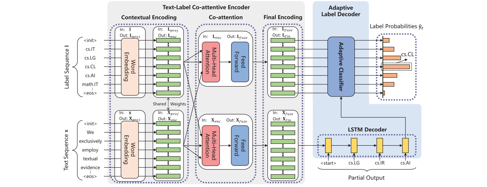

# CNLE: Co-attention network with label embedding for text classification
Created by Minqian Liu, Lizhao Liu and Junyi Cao from South China University of Technology.

This repository contains the official PyTorch-implementation of our [Neurocomputing 2022 paper *Co-attention network with label embedding for text classification*](https://mqianliu.github.io/files/CNLE_Neurocomputing22.pdf).
We release the full code for training the model and the preprocessed AAPD data. Preparing other datasets is easy and we omit them for code release.

<br>



## Dataset
We place datasets under the directory:
```
.data/my_custom_dataset/<DATASET_NAME>
```

## Preprocessing
We preprocess all data into form
```
{"context": "The text to classified.", "question": "class1, class2, ..., classN (All labels from the dataset)", "answer": "The labels for the context."}
```
We provide some preprocessing scripts (for AG News, DP Pedia, Yelp Full) under the `preprocess` folder. For other datasets, just slightly modify the scripts.

## Training
For example, to train the model on Schema Dataset on GPU 0:
```bash
python train.py --train_tasks schema --device 0 --embeddings embedding_path
```
You can resume the model with stored checkpoints using ```--load <PATH_TO_CHECKPOINT>``` and ```--resume```. Note that the checkpoints, configurations and training logs are saved in the directory specified in ```--save```. (```./results``` as default)

## Evaluation
You can evaluate the model with ```EVALUATION_TYPE``` as ```validation``` or ```test```:
```bash
python predict.py --evaluate EVALUATION_TYPE --path PATH_TO_CHECKPOINT_DIRECTORY --device 0 --tasks schema
```
The best checkpoint on validation set will be loaded. If you want to specify a checkpoint to evaluate, use ```--checkpoint_name``` in your command. For example:
```bash
python predict.py --evaluate EVALUATION_TYPE --path PATH_TO_CHECKPOINT_DIRECTORY --device 0 --checkpoint_name iteration_1000.pth --tasks schema
```

## Acknowledgement
Our project is highly based on the [DecaNLP](https://github.com/salesforce/decaNLP) projects. Please go and show some support!